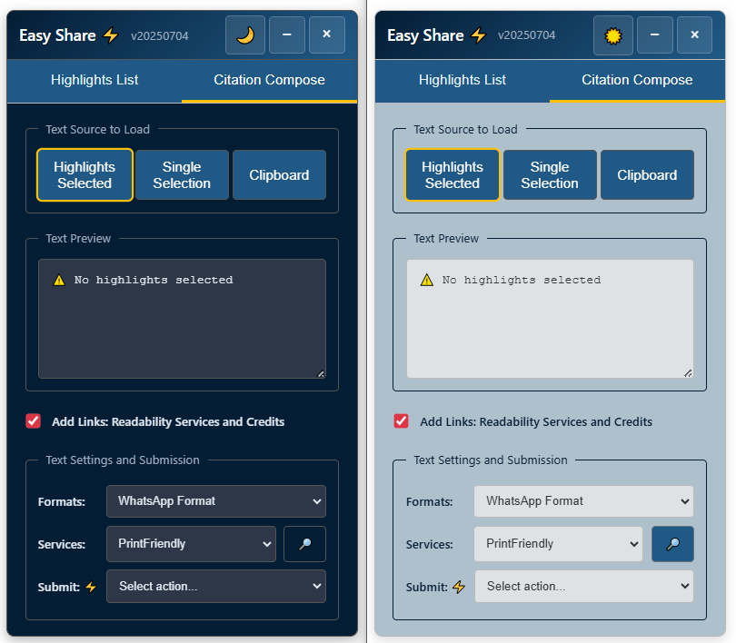

# Easy Share ⚡

**Versão:** v20250707

O Easy Share ⚡ é uma ferramenta de produtividade para a web que permite destacar textos importantes, gerenciá-los e compartilhá-los em diversos formatos. Simplifique sua interação com o conteúdo online!

## 🚀 Como Funciona (Bookmarklet)

O Easy Share ⚡ é um **bookmarklet**, o que significa que ele é um pequeno código JavaScript que você executa a partir de um favorito (marcador) no seu navegador. Ele não é uma extensão ou um aplicativo para instalar.

### Como Adicionar e Executar:

1.  **Obtenha o Código do Bookmarklet:** Você precisará do código JavaScript completo que inicia com `javascript:`.
2.  **Adicione aos Favoritos:**
    * No seu navegador (Chrome, Firefox, Edge, Safari, etc.), clique com o botão direito do mouse na sua **Barra de Favoritos** (ou acesse as opções de gerenciamento de favoritos).
    * Selecione "Adicionar página..." ou "Adicionar favorito...".
    * No campo "Nome", digite "Easy Share" (ou outro nome de sua preferência).
    * No campo "URL" ou "Endereço", **cole todo o código JavaScript do bookmarklet**. Certifique-se de que o prefixo `javascript:` esteja incluído.
    * Salve o favorito.
3.  **Execute:** Para ativar o Easy Share ⚡, navegue até a página da web onde deseja usá-lo e clique no favorito "Easy Share" na sua barra de favoritos.

## ✨ Funcionalidades

* **Realce Inteligente:**
    * Selecione o texto e pressione `Ctrl` (ou `Cmd` no Mac) enquanto solta o botão do mouse para realçar automaticamente.
    * **Validação de Seleção:** A ferramenta agora valida o texto selecionado, informando se é muito longo (limite de 10.000 caracteres) ou está vazio.
    * Clique em um destaque na página para copiá-lo para a área de transferência.

* **Gerenciamento de Destaques:**
    * **Mostrar/Ocultar:** Alterne a visibilidade de todos os destaques na página.
    * **Limpar Tudo:** Remova todos os destaques de uma página (agora com confirmação para evitar perdas acidentais).
    * **Mover:** Reordene seus destaques na lista usando os botões ↑ (mover para cima) e ↓ (mover para baixo) para organizar a ordem.
    * **Pesquisar:** Encontre rapidamente destaques específicos.
    * **Ordenar:** Alterne entre ordenação por criação e alfabética.

* **Opções de Citação e Compartilhamento:**
    * **Modos de Citação:** Destaques Selecionados, Conteúdo da Página e Área de Transferência.
    * **Formatos Diversos:** Gere citações em:
        * WhatsApp Format
        * Citação Acadêmica
        * HTML
        * Markdown
        * Texto Simples
        * Twitter/X
    * **Serviços de Leitura (Readability):** Abra a página atual em:
        * PrintFriendly
        * Archive.is
    * **Ações:** Escolha como usar sua citação:
        * Copiar (com feedback aprimorado para indicar status da área de transferência: "Updating clipboard content..." ou "Permission denied to access clipboard...")
        * WhatsApp
        * Twitter/X
        * E-mail
        * Download

* **Verificação de Fatos (Novo!):**
    * Integre-se a serviços de checagem para verificar rapidamente a veracidade de um destaque.
    * **Serviços Suportados:** Google Fact Check, Aos Fatos (Brasil), Lupa (Brasil).
    * Habilite/desabilite a exibição dos links de verificação e selecione seu serviço preferido.

* **Interface do Usuário (UI):**
    * **Alternar Tema:** Mude entre o tema claro (☀️) e escuro (🌙) da ferramenta. A preferência é salva automaticamente.
    * **Minimizar/Fechar:** Recolha a interface ou a remova da tela, mantendo os destaques salvos.
    * **Arrastar:** Mova a ferramenta livremente pela tela para posicioná-la onde for mais conveniente. A última posição é lembrada.

## ⚠️ Dicas Importantes

* Seus destaques e configurações são **salvos automaticamente** no seu navegador, garantindo que não os perca ao navegar ou fechar a página.
* Pode ser necessário conceder **permissão de área de transferência** em alguns navegadores para que a função de copiar funcione corretamente.
* Se, por algum motivo, um destaque parecer "sumir" da página (por exemplo, após um carregamento dinâmico de conteúdo), o Easy Share ⚡ tentará restaurá-lo automaticamente.